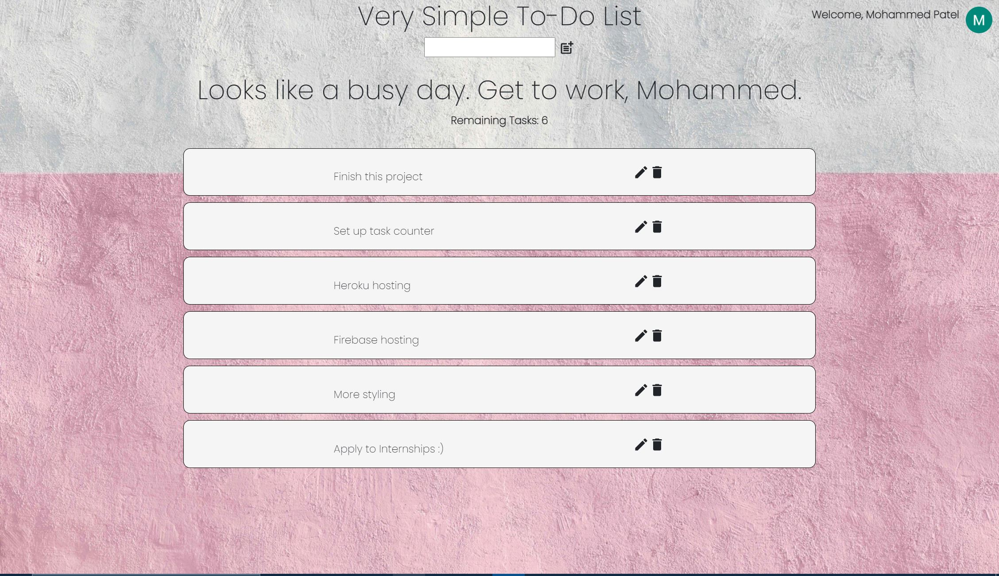

# A very simple, but elegant, To-Do list Web-App

## About

A very simple To-Do List web-app where users can login with their Google accounts and manage their tasks. Users can create new tasks, modify old tasks, and delete tasks that are no longer needed.

The number of tasks users complete (by hitting complete icon) will be tracked and tagged to their profile so users can have a general understanding for how many tasks they have completed. 

## Why Build

As the title states, this is a very simple, but elegant, To-Do List web-app.
This web-app is being created to practice full-stack development. 

I am using this project to gain a better understanding and get more practice with RestAPI building, Database usage, etc. I also get more practice with Firebase and MongoDB, which is a plus.

In addition, I want to try to make this simple web-app look visually pleasing and have cool animations. I think this is the perfect project to get better at CSS animations and dive deeper into css in general.

I was also bored and this seemed fun :)

## Languages, Tools, & Services

Front-End: React, Redux, HTML, CSS, MaterialUI

Back-End: Node, Express, Mongoose

Services: Firebase (Front-end Hosting, Authentication), Heroku (Back-end Hosting), MongoDB Database Storage, Insomnia (API Testing)
